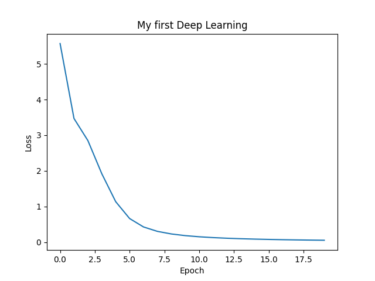
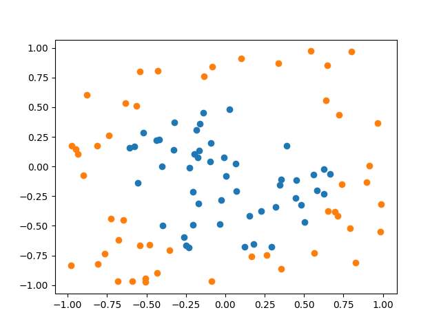
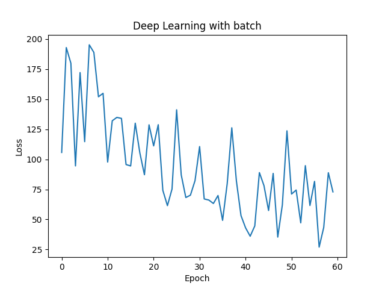
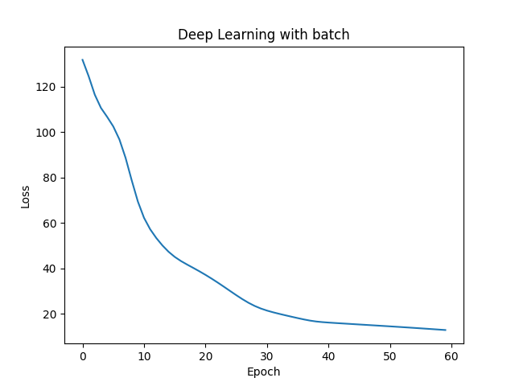

# myPythonNN  
Basic neural network in python from scratch. Made following Andrej Karpathy lecture about backpropagation: https://www.youtube.com/watch?v=VMj-3S1tku0&t=7823s&ab_channel=AndrejKarpathy  
Result following of the lecture:  
python gradient_descent.py  
  
My own experimentation with the usage of batch on simple classification task:  
  
- without batch:  
  
- with batch(saize 8):  
python training_exemple.py  
  
batch size can be change line 30 in training_exemple.py  

Dependencies:  
- Python 3.9.13  
- numpy  
- matplotlib  